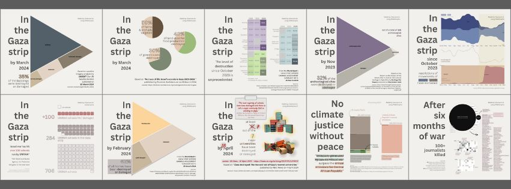

# #30DayChartChallenge 2024

A one month community challenge centered around data visualization.
Click [here](https://github.com/30DayChartChallenge/Edition2024) more info regarding the 2024 edition.

Disclaimer: I chose to focus on the 2023/2024 Israeli war on Gaza. If you don't wish to read on the subject, feel free to disengage from this project.

I only participated for a few days in the month and tried to convey information about an aspect of the conflict in one visual. I wanted to look into infrastructure damaged as it was easier to handle emotionally than the loss of human lives.
This repository includes my notes, datasets, sources, the plots as image files created using RAWGraphs and the visuals made using Canva.

Below is the prompt list with the days I participated highlighted in bold:

* **Comparisons**\
  1\. __part-to-whole__\
  2. neo\
  3. makeover\
  4. __waffle__\
  5. diverging\
  6. data day: OECD
* **Distributions**\
  7. hazards\
  8. __circular__\
  9. major/minor\
  10. __physical__\
  11. mobile-friendly\
  12. theme day: Reuters Graphics
* **Relationships**\
  13. __family__\
  14. __heatmap__\
  15. historical\
  16. weather\
  17. networks\
  18. data day: data.adb.org
* **Timeseries**\
  19. __dinosaurs__\
  20. __correlation__\
  21. __green energy__\
  22. __mobility__\
  23. tiles\
  24. theme day: ILO Africa
* **Uncertainties**\
  25. global change\
  26. AI\
  27. good/bad\
  28. trend\
  29. __black & white__\
  30. theme day: FiveThirtyEight

