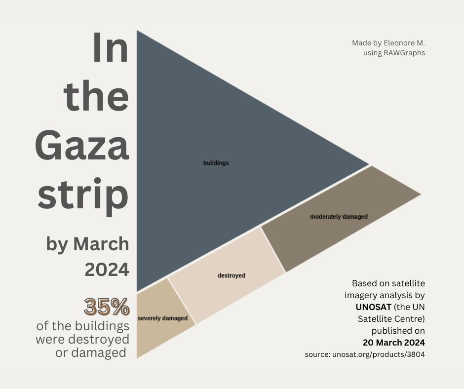

# #30DayChartChallenge 2024

A one month community challenge centered around data visualization.
Click [here](https://github.com/30DayChartChallenge/Edition2024) more info regarding the 2024 edition.

Disclaimer: I chose to focus on the 2023/2024 Israeli war on Gaza. If you don't wish to read on the subject, feel free to disengage from this project.

## Day1: part-to-whole -> Structures damage in the Gaza strip
I tried out RAWGraphics tool on UN satellite analysis data: 35% of structures destroyed or damaged in the Gaza strip by March 2024.

### Source 
[unosat.org/products/3804](https://unosat.org/products/3804)

### Tools
RAWGraphs & Canva

### Visuals

