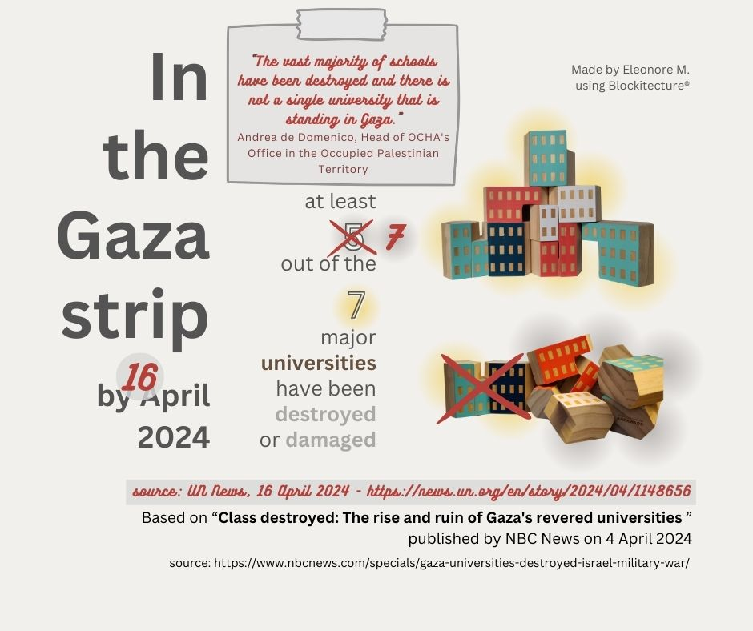
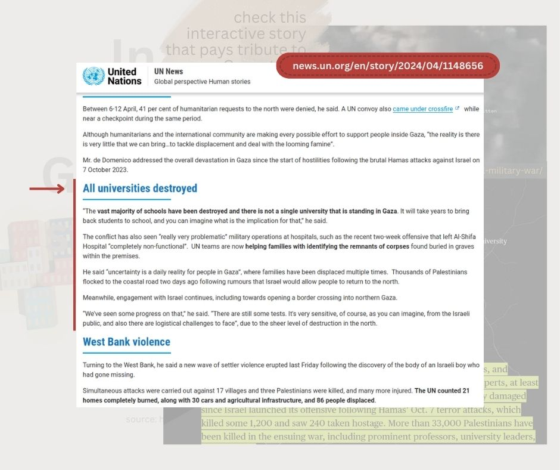

# #30DayChartChallenge 2024

A one month community challenge centered around data visualization.
Click [here](https://github.com/30DayChartChallenge/Edition2024) more info regarding the 2024 edition.

Disclaimer: I chose to focus on the 2023/2024 Israeli war on Gaza. If you don't wish to read on the subject, feel free to disengage from this project.

## Day10: physical -> Wooden architecture blocks to show universities damage in the Gaza strip
I used 7 architectural building blocks to symbolize the 7 major universities of the Gaza strip and show 2 where still standing as of April 2024 based on an NBC News investigation.
I posted an updated version of the visual a few days later, after reading an UN News story saying all universities are destroyed in the Gaza strip.

### Source 
[www.nbcnews.com/specials/gaza-universities-destroyed-israel-military-war](https://www.nbcnews.com/specials/gaza-universities-destroyed-israel-military-war/)

### Tools
Blockitecture® Habitat & Canva

### Visuals

