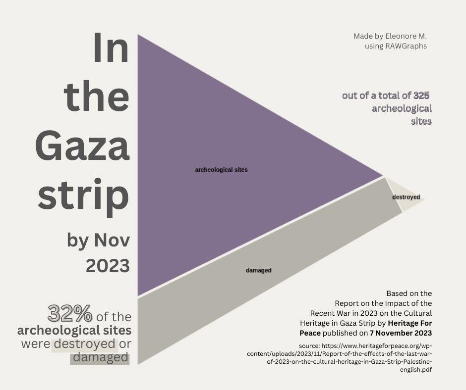

# #30DayChartChallenge 2024

A one month community challenge centered around data visualization.
Click [here](https://github.com/30DayChartChallenge/Edition2024) more info regarding the 2024 edition.

Disclaimer: I chose to focus on the 2023/2024 Israeli war on Gaza. If you don't wish to read on the subject, feel free to disengage from this project.

## Day19: dinosaurs -> Damages to archeological sites in the Gaza strip
Voronoi treemap showing 32% of the archeological sites were destroyed or damaged during the first month of war according to a report by Heritage for Peace.

### Source 
[Heritage for Peace report of November 2023](https://www.heritageforpeace.org/wp-content/uploads/2023/11/Report-of-the-effects-of-the-last-war-of-2023-on-the-cultural-heritage-in-Gaza-Strip-Palestine-english.pdf)

### Tools
RAWGraphs & Canva

### Visuals

