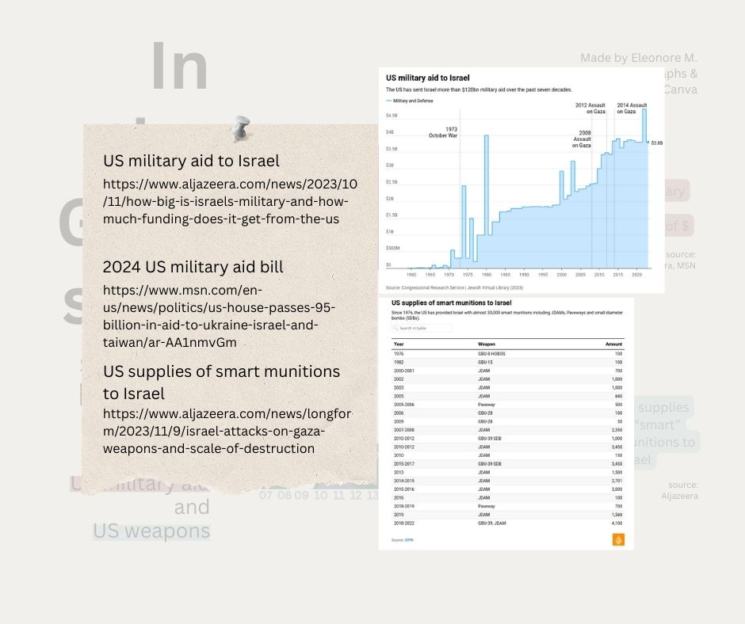

# #30DayChartChallenge 2024

A one month community challenge centered around data visualization.
Click [here](https://github.com/30DayChartChallenge/Edition2024) more info regarding the 2024 edition.

Disclaimer: I chose to focus on the 2023/2024 Israeli war on Gaza. If you don't wish to read on the subject, feel free to disengage from this project.

## Day20: correlation -> Israeli military operations in the Gaza strip & US military aid / supply
Remembering that correlation doesn't necessarily mean causation, I chose to put on one visual the Israeli military operations alongside the casualties they induced since the blockade of the Gaza strip (2007). It shows longer operations and more casualties.
On another visual I represented the US military aid alongside the supply of "smart" ammunitions in the same timeframe. Even without the numbers of ammunition supplied for the current war, it show an increase of both aid and supply.

### Source
* Israel's attacks on Gaza since 2005: 
[Aljazeera article](https://www.aljazeera.com/news/2022/8/7/timeline-israels-attacks-on-gaza-since-2005)
[Wikipedia article](https://en.wikipedia.org/wiki/Gaza%E2%80%93Israel_conflict)
* US military aid to Israel:
[Aljazeera article](https://www.aljazeera.com/news/2023/10/11/how-big-is-israels-military-and-how-much-funding-does-it-get-from-the-us)
[MSN news article](https://www.msn.com/en-us/news/politics/us-house-passes-95-billion-in-aid-to-ukraine-israel-and-taiwan/ar-AA1nmvGm)
* US supplies of "smart" munitions to Israel:
[Aljazeera article](https://www.aljazeera.com/news/longform/2023/11/9/israel-attacks-on-gaza-weapons-and-scale-of-destruction)

### Tools
RAWGraphs & Canva

### Visuals

