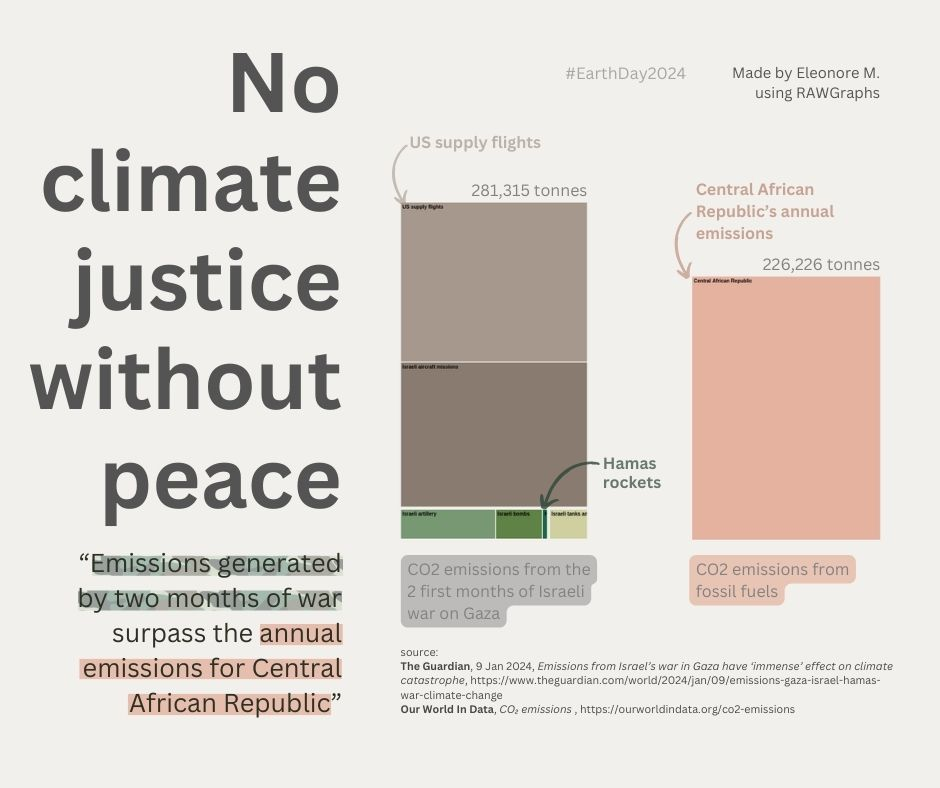

# #30DayChartChallenge 2024

A one month community challenge centered around data visualization.
Click [here](https://github.com/30DayChartChallenge/Edition2024) more info regarding the 2024 edition.

Disclaimer: I chose to focus on the 2023/2024 Israeli war on Gaza. If you don't wish to read on the subject, feel free to disengage from this project.

## Day21: green energy -> Emissions generated by 2 months of war in Gaza
That day, I saw on my social media timeline a Guardian article by a climate justice reporter. They highlight the Carbon emissions generated during the first sixty days (over 200,000 tonnes of CO2) of the war and how these emissions compare to the annual emissions of countries. These emissions therefore contribute to the current climate crisis.

### Source
* [Emissions from Israel's war in Gaza have 'immense' effect on climate catastrophe](https://www.theguardian.com/world/2024/jan/09/emissions-gaza-israel-hamas-war-climate-change)
* [CO2 emissions](https://ourworldindata.org/co2-emissions)

### Tools
RAWGraphs & Canva

### Visuals

