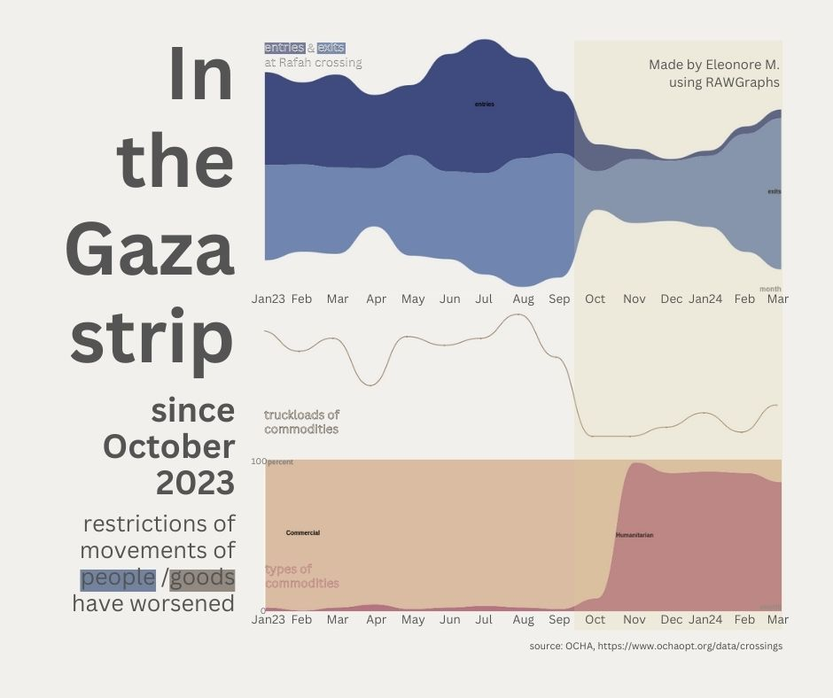
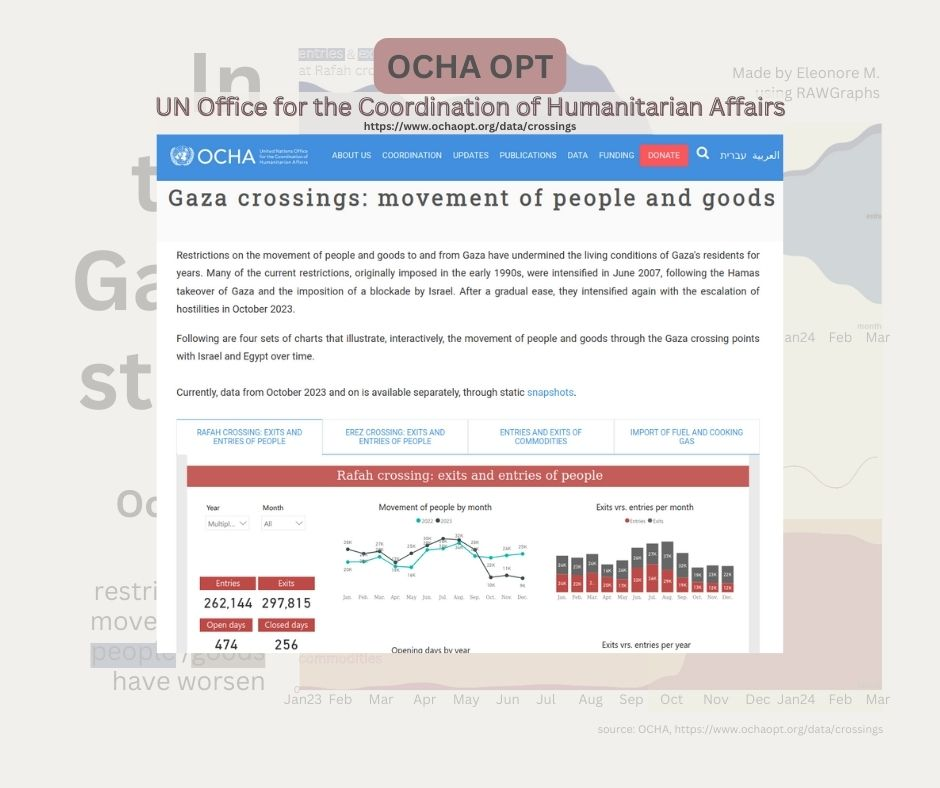

# #30DayChartChallenge 2024

A one month community challenge centered around data visualization.
Click [here](https://github.com/30DayChartChallenge/Edition2024) more info regarding the 2024 edition.

Disclaimer: I chose to focus on the 2023/2024 Israeli war on Gaza. If you don't wish to read on the subject, feel free to disengage from this project.

## Day22: mobility -> Crossing of people and goods into or out of Gaza
3 times series in parallel: entries/exits of people, truckloads of commodities, and types of commodities that went through the Rafah crossing between January 2023 and March 2024. The graphs start months before the war to get an idea of how the flows of people and goods usually fluctuate. We clearly see that during the months of the war (highlighted in pale yellow) all flows decreased dramatically from October 2023, and then the exit of people started to increase progressively from January 2024. 

### Source
* [OCHA OPT crossings data](https://www.ochaopt.org/data/crossings)

### Tools
RAWGraphs & Canva

### Visuals

