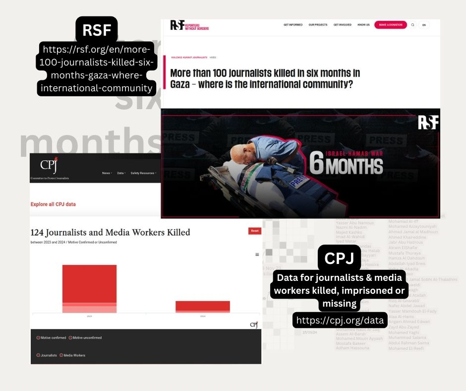

# #30DayChartChallenge 2024

A one month community challenge centered around data visualization.
Click [here](https://github.com/30DayChartChallenge/Edition2024) more info regarding the 2024 edition.

Disclaimer: I chose to focus on the 2023/2024 Israeli war on Gaza. If you don't wish to read on the subject, feel free to disengage from this project.

## Day29: black & white -> 100+ journalists killed in the Gaza strip over 6 months
The circle packing chart higlights the high number of media workers killed in this war (in Israel & the Occupied Palestinian Territories and in Lebanon) compared to anywhere else in the world.
The calendar heatmap shows more of them were killed in the first 3 months of the war.
I added a list of the names, and highlited the Israeli journalist killed during the terror attack on kibbutz Nahal Oz on October 7.

### Source
* [RSF (Reporters Without Borders)](https://rsf.org/en/more-100-journalists-killed-six-months-gaza-where-international-community)
* [Committee to Protect Journalists database](https://cpj.org/data/)

### Tools
RAWGraphs & Canva

### Visuals

