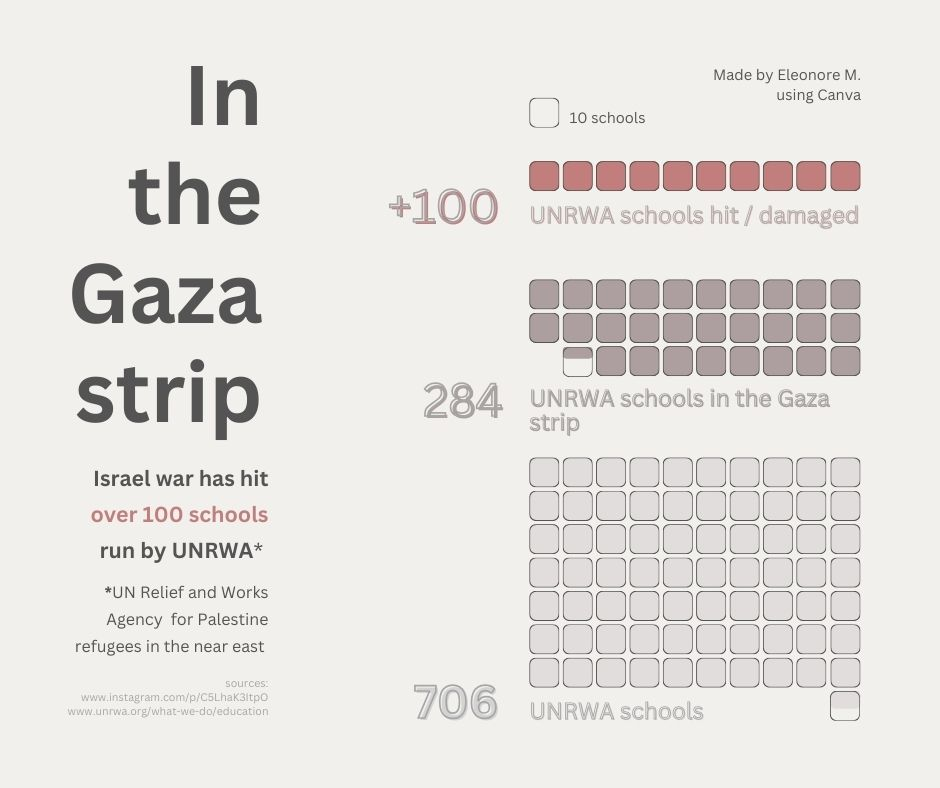
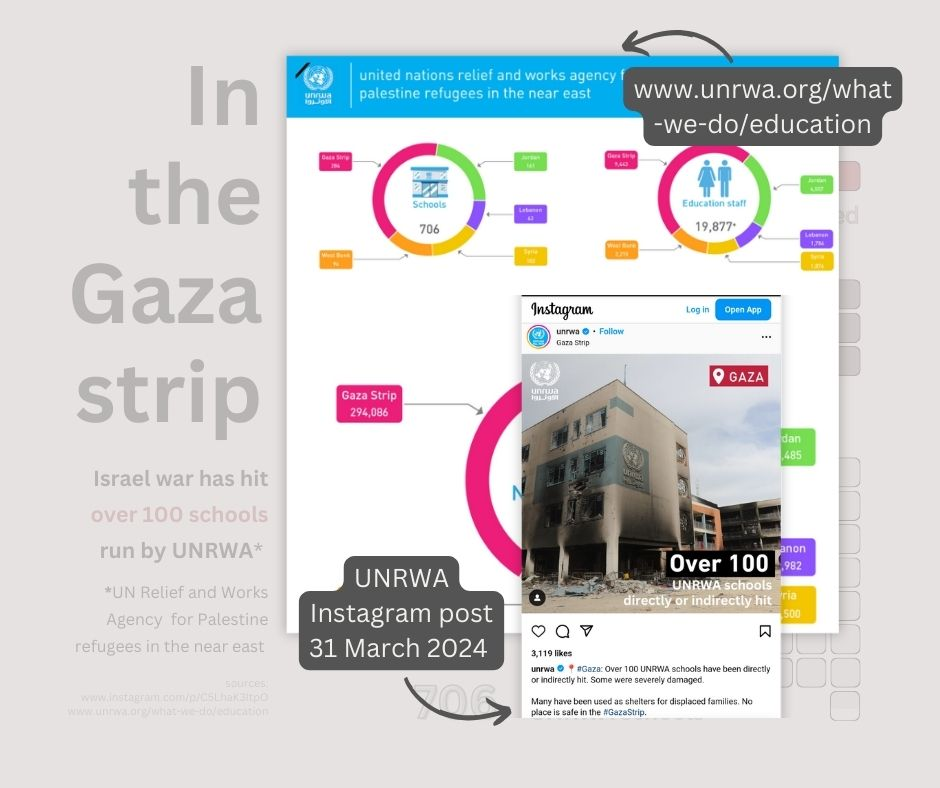

# #30DayChartChallenge 2024

A one month community challenge centered around data visualization.
Click [here](https://github.com/30DayChartChallenge/Edition2024) more info regarding the 2024 edition.

Disclaimer: I chose to focus on the 2023/2024 Israeli war on Gaza. If you don't wish to read on the subject, feel free to disengage from this project.

## Day4: waffle -> Waffle chart of schools damage in the Gaza strip
Please don't judge too harshly my first attempt at waffle charts using square elements in Canva. Hopefully I managed to communicate some data about UNRWA schools damaged in Gaza.

### Source 
[www.unrwa.org/what-we-do/education](https://www.unrwa.org/what-we-do/education)
[UNRWA Instagram post](https://www.instagram.com/p/C5LhaK3ItpO/)

### Tools
Canva

### Visuals

